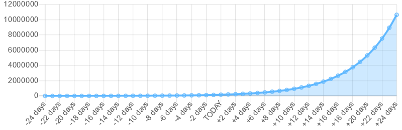

# covid-19-calculator
Calculates current number of infections based on official deaths and other statistics

👉 [https://cd.github.io/covid-19-calculator/](https://cd.github.io/covid-19-calculator/)

## Background Information (March 18, 2020)

The SARS-CoV-2 virus is currently scaring many people around the world. There is great uncertainty among the population, politics and the economy. Finding the right balance between health and economy is not easy.

It is difficult to get a feel for the actual number of infections and the rate of spread:

- The current number of infections is unknown because the incubation period is long and only a few people are tested.
- The number of infections increases exponentially and the human brain is unable to think so.

In Germany, 8198 people were officially infected with the virus and 26 have already died (as of March 18, 2020). The number of unreported cases is estimated to be significantly higher. But how high exactly? In fact, this number can be calculated using simple mathematical means.

You just need four numbers:
- The number of those who have already died
- The mortality rate
- The average number of days from infection to death
- The doubling time, which indicates after how many days the number of infections doubles

[In the case of China and the cruise ship, such data was collected](https://github.com/midas-network/COVID-19/blob/master/parameter_estimates/2019_novel_coronavirus/README.md).

The average number of days from infection to death is made up of the incubation period and the time from the first symptoms to death.

I choose the following data as example for Germany:
- 26 people died
- Every hundredth infected person dies (1% mortality rate)
- 24 days from infection to death (6 days of incubation period + 18 days from symptom onset to death)
- The number of infections doubles every 4 days

The following calculation does not consider the people who have already recovered. This simplification is acceptable because it only plays a minor role at the beginning of an epidemic.

And here is the calculation:
26 people died. These people became infected 24 days ago or were already infected. Due to the mortality rate, 2600 people were already infected 24 days ago:

```
26 deaths / 1% = 2600 infected people
```

The doubling time of 4 days means that the number of infections should have doubled 20 days ago. Until today, this doubling has occurred 6 times:

```
24 days / 4 = 6 doublings
```

It follows:

```
2600 people * 2^6 = 166400 infected today
```

In just one week (+7 days) there are 7.75 doublings and 559701 infected people (+ 236 %!):

```
2600 people * 2^7.75 = 559701 infected in 7 days
```

In two weeks there will be almost 2 million people. This is exponential growth.

The example can be represented well in a chart:



[I developed a tool that does exactly these calculations and creates such a chart](https://cd.github.io/covid-19-calculator/). This gives an impressive sense of what the actual number of infections is and what exponential growth means.

**Addendum from 30-03-2020**

To make it clear: Of course, this is a purely analytical, but correct approach. Unfortunately, the reality has no constant input parameters. By interrupting the infection chains or quarantine regulations, the doubling time, which is included as an exponent in the equation, is changed. Likewise, if the health system is overloaded, the mortality rate increases.

**Addendum from 04-06-2020**

The pandemic has been around for a few months and the number of infections is no longer exponential. In many cases, they are even declining. At this point it makes no sense to speak of a doubling time. This means that the calculator can no longer be used for the current situation.